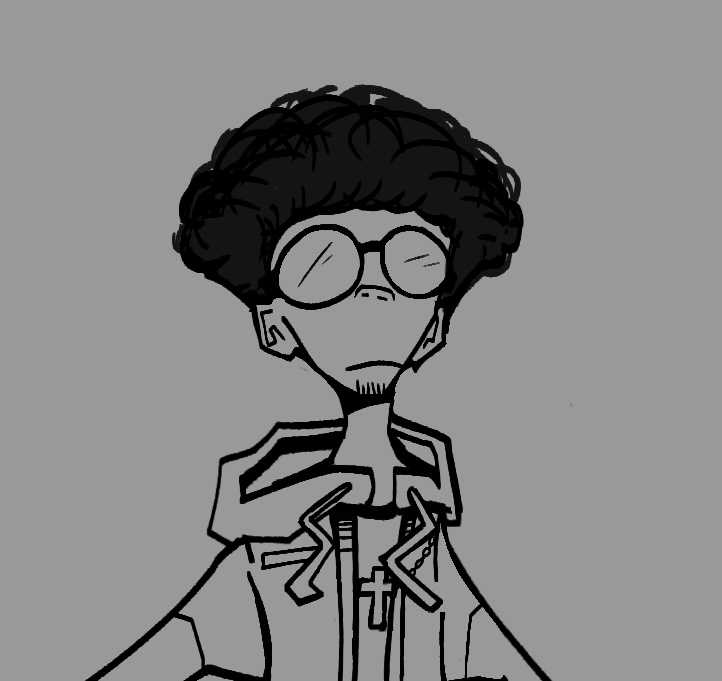

Nebiyu's Personal CV Website
----------------------------

Project Description:
--------------------
This is a basic HTML website that serves as a personal CV (Curriculum Vitae) for Nebiyu Samuel. 
It includes three pages: a main CV page, a hobbies page, and a contact page.

File Structure:
---------------
1. index.html
   - Main page of the website.
   - Displays a profile picture, name, education, skills, and links to other pages.
   - The profile picture is currently loaded from an online GitHub link.
   - Contains links to hobbies.html and contacts.html.

2. hobbies.html
   - A short page listing hobbies in an ordered list.

3. contacts.html
   - Contains personal contact information (email, phone, GitHub).
   - Includes a basic form that uses "mailto:" to send messages directly through an email client.
   - The form may not work unless the user has a default email client set up.

How to Open the Website:
------------------------
1. Open index.html in any web browser.
2. Click the links at the bottom to visit the Hobbies or Contact pages.

Image Information:
------------------
The profile picture is loaded from this URL:
https://raw.githubusercontent.com/charismatic-design/My-Personal-CV/refs/heads/main/Images/pfp.PNG

If you prefer to use a local image instead:
- Create a folder named "Images"
- Save the image inside it as "pfp.PNG"
- In index.html, change the image tag to:
  

Additional Notes:
-----------------
- This project uses only HTML (no CSS or JavaScript yet).
- Created as part of learning from "The Complete Web Development Bootcamp" by Dr. Angela Yu.
- Simple structure, good for practicing multi-page HTML layout.

Author: Nebiyu Samuel
